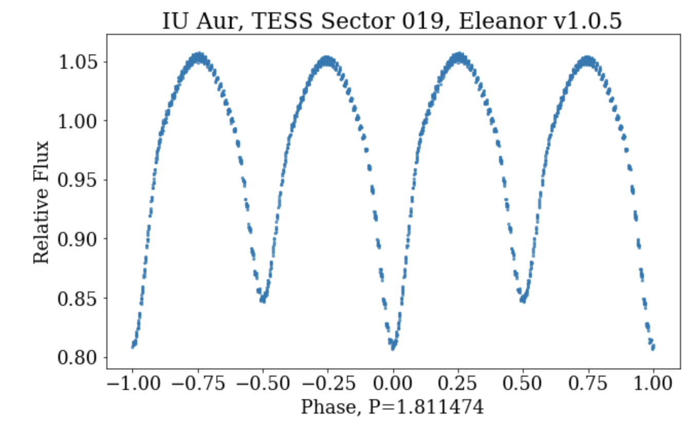

# Inclination-changing Eclipsing Binaries (EBs)

Looking for systems in the Milky Way that TESS has observed

Starting with previously known systems - e.g. Table 1 from [Jurysek et al. (2018)](https://ui.adsabs.harvard.edu/abs/2018A&A...609A..46J)

